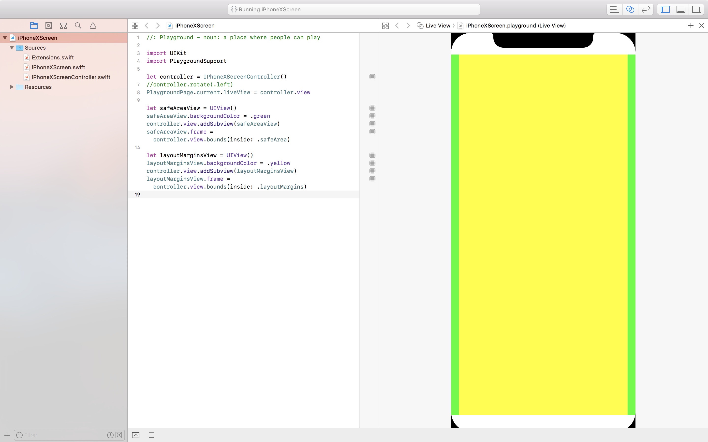

# PlaygroundWithiPhoneXScreen
A Swift Playground template with iPhone X screen in it.

Of course you can also use Auto Layout constraints in it if you wish to. But rotate the screen **before** attaching the view to `PlaygroundPage.current.liveView` otherwise Xcode can't render the view with correct size.

